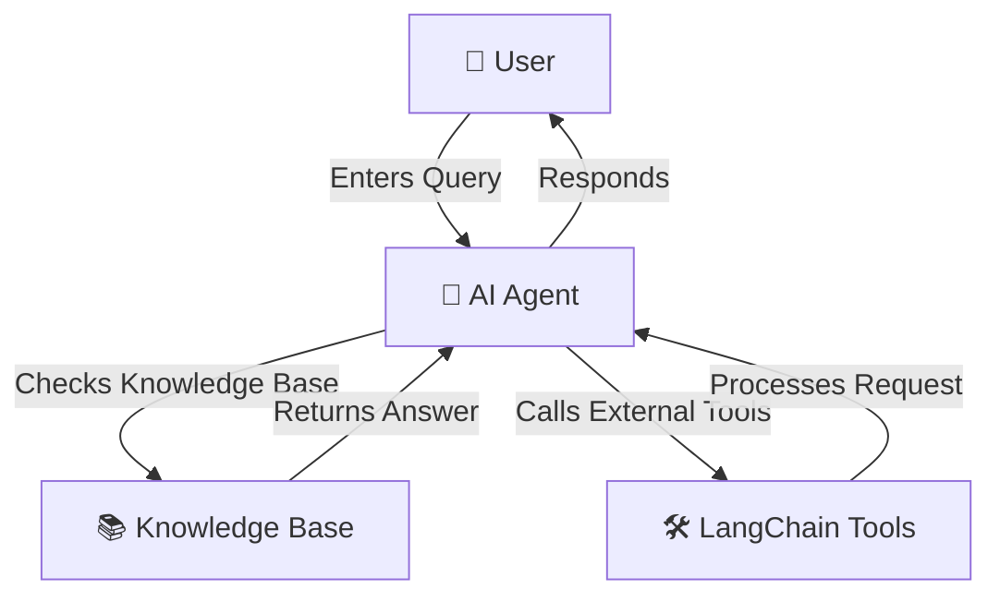

# 🛠️ Customer Support AI Agent

This project is a **basic AI-powered customer support assistant** built using **LangGraph**, **LangChain**, and **OpenAI's Llama-3.1 model**.  
The assistant can:
- Answer frequently asked customer queries using a predefined knowledge base.  
- Provide customer support contact information when needed.  
- Run as a live chatbot in the terminal.

---

## 📌 Features
🔹 **AI-powered responses** to customer queries  
🔹 **Knowledge base lookup** for common questions  
🔹 **Live chatbot interface** via the terminal  
🔹 **Tool-based response system** using LangChain  
🔹 **Easy API configuration** via environment variables  

---

## 🏗️ Tech Stack

| Technology | Purpose |
|------------|---------|
| **Python** | Primary language |
| **LangGraph & LangChain** | AI workflow and tool management |
| **OpenAI Llama-3.1** | LLM for responses |
| **dotenv** | Environment variable management |
| **Git** | Version control |

---
## 🖼️ System Architecture

Below is the high-level architecture of the AI Agent:




## 🚀 Setup Instructions

### 📥 1. Clone the Repository
```bash
git clone https://github.com/your-username/customer-support-ai.git
cd customer-support-ai
```


### 🔧 Install Dependencies
Ensure you have **Python** installed, then run:
```
pip install -r requirements.txt
```

### 🔑 Set Up API Keys
Create a .env file in the project root and add:
```
OPEN_AI_API_KEY = "your-api-key-here"
BASE_URL = "https://openrouter.ai/api/v1"
```
### ▶️ Run the AI Agent
Start the chatbot using:
```
python main.py
```

## 📝 Usage Instructions

> 💬 **Hello, I am an AI Agent.**  
> Please enter your query below.  
> Type **'exit'** or **'quit'** to end the conversation.  
>  
> **You:** _[Type your query here]_

#### Example Queries:
> ❓ **What are your working hours?**  
> ❓ **Tell me about refunds.**  
> ❓ **How does shipping work?**

## Project Structure
```
📦 customer-support-ai
├── 📄 main.py            # Main chatbot script
├── 📄 requirements.txt   # Dependencies
├── 📄 .env               # API keys (ignored in Git)
├── 📄 README.md          # Documentation
```
## License
This project is licensed under the MIT License. Feel free to use and modify it.

## Author
[Samarth Munde](https://github.com/mundesamarth)

---
_If you found this project useful, feel free to ⭐ star the repository!_
